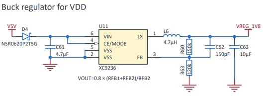
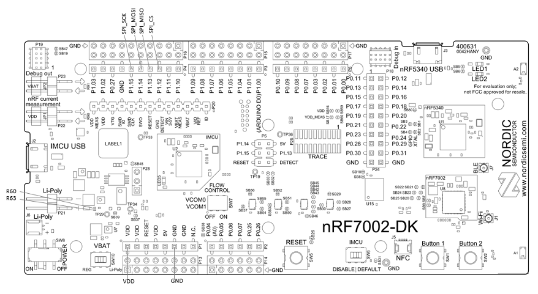
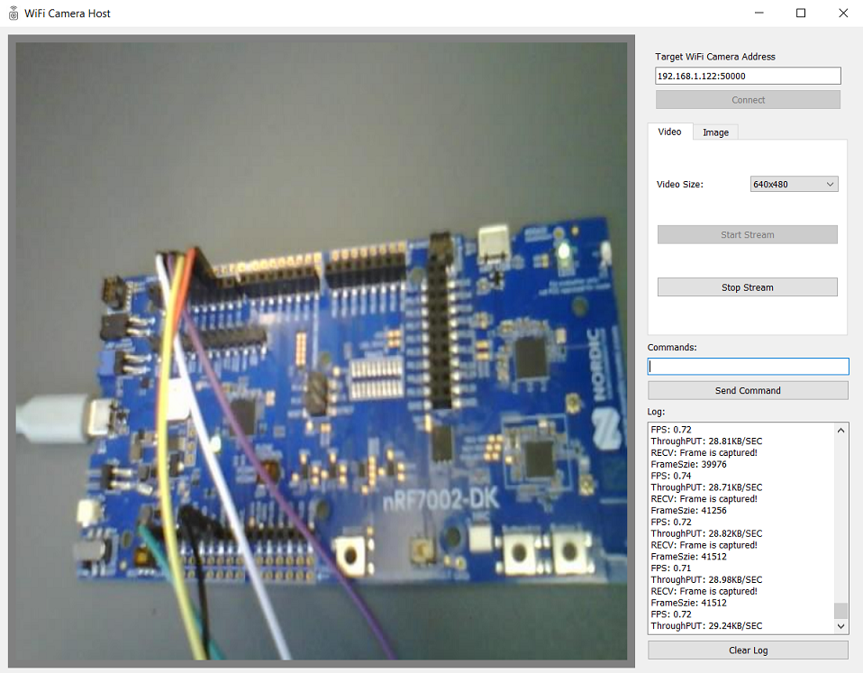

# nRF70_WiFi_Camera_Demo
WiFi Camera demo based on the nRF7002DK and the Arducam Mega Camera.

# Hardware Setup

---

## Arducam Mega Camera

* [Product Page](https://docs.arducam.com/Arduino-SPI-camera/MEGA-SPI/MEGA-SPI-Camera/)
* [Datasheet](https://www.arducam.com/downloads/datasheet/Arducam_MEGA_SPI_Camera_Application_Note.pdf)
* [Communication Protocol](https://www.arducam.com/docs/arducam-mega/arducam-mega-getting-started/packs/HostCommunicationProtocol.html)

## nRF7002DK 

* [Product Page](https://www.nordicsemi.com/Products/Development-hardware/nRF7002-DK) (Including schematic and PCB files in Downloads tab)
* [User Guide](https://infocenter.nordicsemi.com/topic/ug_nrf7002_dk/UG/nrf7002_DK/intro.html)
* [nRF7002 Specification](https://infocenter.nordicsemi.com/topic/ps_nrf7002/keyfeatures_html5.html)

## Hardware Connection

On the nRF7002DK, the nRF5340 host MCU uses 1.8v as VDD supply voltage for IO pins to interface with the nRF7002 WiFi companion IC. The Arducam Mega Camera IO voltage only supports 3.3v/5v.
Considering the max acceptable VDD supply voltage for the nRF7002 is 3.6v according to the nRF7002 specification(Table 11: Recommended operating conditions) we need to change nRF5340 IO VDD supply voltage from 1.8v to 3.3v. 

According to the following regulator design in the nRF7002DK schematic, modifying R60 to 375K or R63 to 48K will change the IO voltage to 3.3v.



Here is the pin connection with the Arducam Mega SPI Camera marked on the nRF7002DK.




# Firmware Preparation
---

## Main features:

The fimware running on Camera Device(nRF7002DK+ArduCAM Mega) has following main features:

1. Connect with Wi-Fi Camera host and BLE Camear App at same time.
2. The device can run at both SoftAP mode and Station mode. It will run at SoftAP mode at 5GHz by default so PC host can connect with it direclty without a router. Press button 1 in three seocnds after booting to swith to Station mode.
3. For Wi-Fi connection, it can support eithe UDP or TCP scocket. UDP is used by default, and it can swith to TCP socket by adding "overlay_tcp_socket.conf".

## Install nRF Connect SDK(NCS) version 2.7.0

Please refer to https://developer.nordicsemi.com/nRF_Connect_SDK/doc/2.7.0/nrf/installation.html

## Download this repository

```
git clone https://github.com/NordicPlayground/nrf70-wifi-ble-image-transfer-demo.git
```

## Apply arducam_mega_support.patch to add ArduCAM Mega Camera Zephyr driver

Copy arducam_mega_support.path into ncs/v2.7.0/zephyr folder and run the following command to apply and check the patch changes.

```
PS C:\ncs\v2.7.0\zephyr> git apply ncs270.patch
PS C:\ncs\v2.7.0\zephyr> git status 
On branch arducam
Changes not staged for commit:
  (use "git add <file>..." to update what will be committed)
  (use "git restore <file>..." to discard changes in working directory)
        modified:   drivers/video/CMakeLists.txt
        modified:   drivers/video/Kconfig
        modified:   dts/bindings/vendor-prefixes.txt
        modified:   include/zephyr/drivers/video-controls.h
        modified:   include/zephyr/drivers/video.h

Untracked files:
  (use "git add <file>..." to include in what will be committed)
        drivers/video/Kconfig.arducam_mega
        drivers/video/arducam_mega.c
        dts/bindings/video/arducam,mega.yaml
        include/zephyr/drivers/video/
        samples/drivers/video/

no changes added to commit (use "git add" and/or "git commit -a")
```

## Firmware Building

1) Build the firmwre using UDP socket using nRF Connect SDK VS Code extension GUI or the following command.

```
west build -b nrf7002dk_nrf5340_cpuapp
```

2) Firmware that use TCP socket.

```
west build -b nrf7002dk_nrf5340_cpuapp -- -DEXTRA_CONF_FILE=overlay_tcp_socket.conf
```

## Wi-Fi Connection build

1) SoftAP Mode

Connect you PC to the AP with following SSID and Password:

```
CONFIG_SOFTAP_SAMPLE_SSID="WiFi_Cam_Demo_AP"
CONFIG_SOFTAP_SAMPLE_PASSWORD="nRF7002DK"
```

2) Station Mode
Press button 1 in three seocnds after device booting to swith to Station mode. Wi-Fi provisioning has to be handled at runtime. To do so open a UART terminal and connect it to VCOM1 on the nRF7002DK. Use the following commands to connect with the target WiFi AP. Please refer to DevAcademy [WiFi Fundamentals course Exercise 1](https://academy.nordicsemi.com/courses/wi-fi-fundamentals/lessons/lesson-3-wifi-fundamentals/topic/lesson-3-exercise-1-2/) for more details about "wifi_cred" commands.

```
uart:~$ wifi_cred help
wifi_cred - Wi-Fi Credentials commands
Subcommands:
  add           :Add network to storage.
  auto_connect  :Connect to any stored network.
  delete        :Delete network from storage.
  list          :List stored networks.
uart:~$ wifi_cred add help
Usage: wifi_cred add "network name" {OPEN, WPA2-PSK, WPA2-PSK-SHA256, WPA3-SAE} [psk/password] [bssid] [{2.4GHz, 5GHz}] [favorite]
uart:~$ wifi_cred add "your-ssid" WPA2-PSK "your-password"
uart:~$ wifi_cred auto_connect
```
If the nRF7002DK connected with an AP succesfully,  you will see its IP address in the local network. The WiFi credentionals also will be stored. Only "wifi_cred auto_connect" be necessary next time to do connection.

# WiFi Camera Host GUI Application(WiFiCamHost) 

---

The WiFICamHost is a python script that can run on any PC to communicate with the WiFi Camera Device(nRF7002DK + ArducamMegaCamera here) through the UDP protocol.
Ensure you have installed a recent Python version then run the following command to start the application on your PC terminal:

```
cd WiFICamHost
pip install -r requirements.txt
python WiFi_Cam_Host_UDP.py
```

# Testing

1) After Wi-Fi connnection is built between PC and Wi-Fi Camera. Run the WiFiCamHost script according to the socket type the firmware supported. 
2) In the Video table, choose a resolution and press start stream, then the video stream will start.



